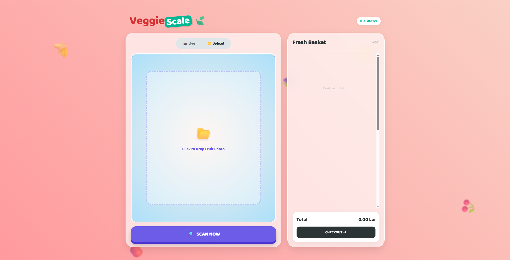
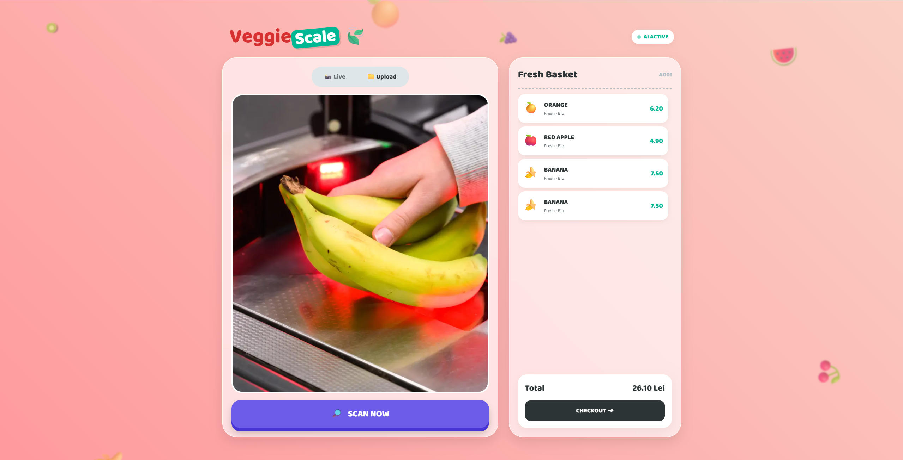

# 🍎 VeggieScale AI


**VeggieScale** is a smart self-checkout system that uses Artificial Intelligence to recognize fruits and vegetables automatically. No more searching through menus—just place the item, and the AI does the rest.

---

## 📸 Screenshots

### 1. Main Interface


### 2. Scanning & Detection


### 3. Juicy Receipt


---

## 🚀 Installation & Usage

Follow these simple steps to run the project on your computer:

### 1. Install Dependencies
```bash
pip install -r requirements.txt
```

### 2. Start the App
```bash
python app.py
```

### 3. Open in Browser
```bash
http://127.0.0.1:5000
```

---

## 🛠️ Features
- **AI Recognition**: Detects Bananas, Apples, and Oranges instantly using MobileNetV2.
- **Smart UI**: Animated, colorful interface designed for modern retail.
- **Dual Input**: Works with Live Webcam or Image Upload.
- **Digital Receipt**: Exports transaction data to JSON format.

---

## 👤 Author
Andrei Dinescu  
Automation & Computer Science Student

