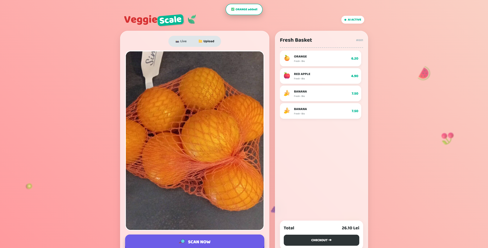

# 🍎 VeggieScale AI - Intelligent Self-Checkout System


**VeggieScale** is a state-of-the-art Computer Vision application designed to automate the checkout process in retail environments. By leveraging Deep Learning, the system instantly identifies fruits and vegetables placed on a scale, eliminating the need for manual menu navigation and reducing checkout time.

The project showcases a full-stack implementation: from dataset collection and model training to a responsive web-based interface suitable for kiosk deployment.

---

## 📸 System Preview

### 1. Live Detection Interface

*Real-time inference loop running on the Flask server.*

### 2. Intelligent Scanning

*The system detecting products with high confidence (>95%).*

### 3. Digital Receipt & Export

*Dynamic receipt generation with JSON database export capabilities.*

---

## 🧠 AI & Technical Architecture

This project is not just a wrapper around an API; it uses a custom-trained neural network tailored for edge deployment.

### 1. The Model: MobileNetV2
We chose **MobileNetV2** over heavier architectures (like ResNet50) to prioritize **inference speed** on non-GPU hardware (standard laptops, POS terminals).
* **Transfer Learning:** The model was pre-trained on ImageNet to understand basic shapes and textures.
* **Fine-Tuning:** We replaced the final fully connected layer (`classifier[1]`) to output probabilities for our specific classes (Banana, Red Apple, Orange).
* **Input Resolution:** 224x224 pixels (Standard RGB).

### 2. Training Pipeline
* **Data Augmentation:** To ensure robustness against lighting changes and object orientation, the training pipeline applies:
    * Random Rotations (±30°)
    * Color Jitter (Brightness/Contrast)
    * Random Horizontal/Vertical Flips
* **Optimization:** Used `Adam` optimizer with `CrossEntropyLoss`.
* **Hardware Acceleration:** Training accelerated using NVIDIA CUDA cores, with fallback support for CPU.

---

## 🛠️ Software Stack

| Layer | Technology | Description |
| :--- | :--- | :--- |
| **Machine Learning** | **PyTorch & Torchvision** | Model training, loading, and tensor manipulation. |
| **Backend API** | **Flask** | Lightweight Python web server handling `POST` inference requests. |
| **Frontend** | **HTML5 / CSS3** | Modern "Glassmorphism" UI with CSS animations and gradients. |
| **Scripting** | **Vanilla JavaScript** | Async `fetch` API for non-blocking camera capture and server communication. |
| **Data Handling** | **Pillow (PIL)** | Image preprocessing before tensor conversion. |

---

## 📂 Project Structure

```text
VeggieScale/
├── app.py                 # Main Flask entry point & Route handlers
├── veggie_mobilenet.pth   # The trained PyTorch model weights
├── classes.txt            # Class labels (banana, orange, red_apple)
├── requirements.txt       # Python dependencies
│
├── templates/
│   └── index.html         # The main application interface
│
└── static/
    ├── style.css          # Custom styling & animations
    └── script.js          # Client-side logic (Camera/Upload)
```

---

## 🚀 Installation & Setup
Follow these steps to deploy the application locally:

### 1. Prerequisites
Ensure you have Python 3.8+ installed on your system.

### 2. Installation
Open your terminal in the project folder:
```bash
# Install all required packages
pip install -r requirements.txt
```

### 3. Launching the System
Start the Flask server:
```bash
python app.py
```
After the server starts, open your browser and navigate to:
```bash
http://127.0.0.1:5000
```

---

## 🌟 Features
- **Dual-Mode Input:** Users can switch seamlessly between Live Camera Feed (for kiosks) and File Upload (for testing/static images).
- **Confidence Thresholding:** The system only adds items to the cart if the AI confidence score exceeds 95%, ensuring billing accuracy.
- **Smart Feedback:** Visual toast notifications (Success/Error) inform the user about the detection status.
- **Data Persistence:** The "Export DB" feature allows saving transaction logs locally as structured JSON files.

---

## 👤 Author & Credits
Andrei Dinescu  
Automation & Computer Science Student

Dataset sources: Bing Images / Pexels (Curated for academic research).

Base Model: PyTorch Hub (MobileNetV2).
